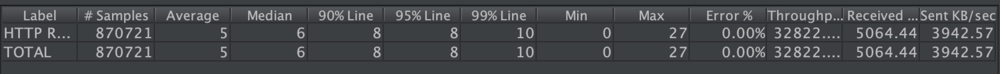

# sw-fw-less

>## Description
Swoole http server without framework

>## Features
1. Faster Router
2. Router & Global Middleware
3. Model(MySQL & Eleasticsearch、Json Serializable、Array Accessable)
4. Query Builder(MySQL & Elasticsearch)
5. Connection Pool(MySQL & Redis)
6. Storage(File & Qiniu)
7. Full Coroutine
8. Log(Based on Monolog)
9. Distributed Lock(Based on Redis)
10. Parameter Validator
11. Monitor

>## Deployment
Nginx Config Demo(Modify according to your requirements)
```shell
server {
    listen 80;
    
    ## Modify according to your requirements
    server_name www.sw-fw-less.dev;

    location / {
        ## Modify according to your requirements
        proxy_pass http://127.0.0.1:9501;
    }
}
```

>## Usage
Start Server
```php
php start.php
```

Demo Api
```shell
curl -i 'http://127.0.0.1:9501/ping'
```

>## Performance
* OS: MacOS 10.14.1
* CPU: 2.3 GHz Intel Core i5 Dual Core
* Memory: 16 GB 2133 MHz LPDDR3
* Swoole: 4.2.9
* PHP: 7.2.8
* Redis: 4.0.11
* API: http://127.0.0.1:9501/redis?key=key
* Concurrent: 300
* Tool: JMeter 4.0 r1823414



>## Document
todo
