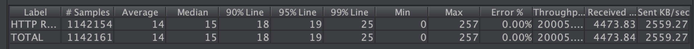

# sw-fw-less

## Description
Swoole http server without framework

## Features
1. Faster Router
2. Middleware
3. Model(MySQL & Eleasticsearch)
4. Query Builder(MySQL & Elasticsearch)
5. Connection Pool(MySQL & Redis)
6. Storage(File & Qiniu)
7. Full Coroutine
8. Log(Based on Monolog)
9. Distributed Lock(Based on Redis)
10. Parameter Validator

## Deploy

## Usage

## Performance

